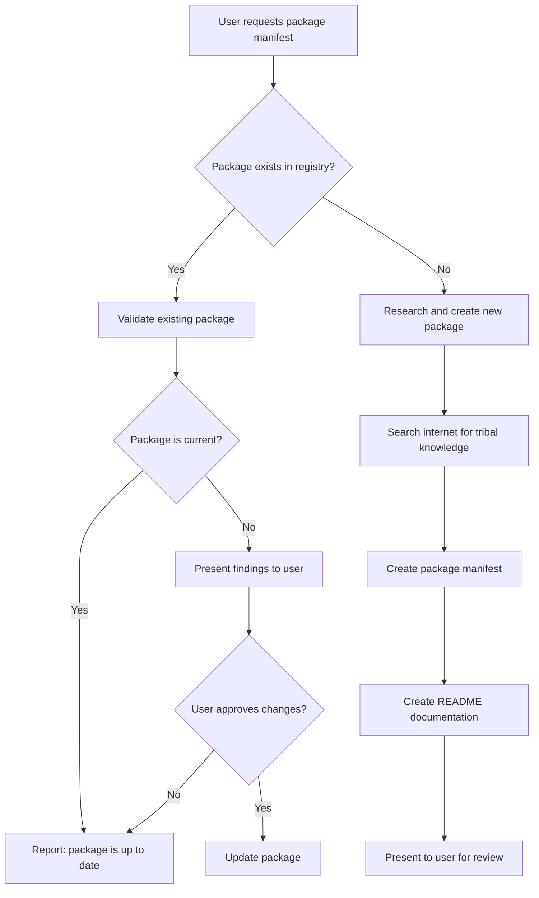

# Package Manifest Authoring Guide

Instructions for AI assistants to create or validate lore package manifests.

## Trigger

When the user says:

> **"give me a package manifest for `<product-name>`"**

Follow this workflow.

## Workflow Overview



## Phase 1: Check Existing Packages

**Always start here.** Search the registry before creating anything new.

### 1.1 Search the Registry

```
packages/<product-name>/
```

Also search for variations:
- Hyphenated: `aws-cli`, `azure-cli`
- Concatenated: `kubectl`, `terraform`
- Abbreviated: `xcode-clt` for "Xcode Command Line Tools"

### 1.2 If Package Exists: Validate Currency

Read the existing `lifecycle.yaml` and check:

| Check | How to Validate |
|-------|-----------------|
| **Version** | Search web for current stable version |
| **Installation method** | Verify documented method still works |
| **URLs** | Confirm homepage, repository URLs are valid |
| **Platform support** | Check if new platforms are supported |
| **Features** | Look for new optional components |

**Important**: Do NOT modify the existing package without explicit user approval. Present findings:

```
Package `<name>` exists in the registry.

Current state:
- Version in manifest: X.Y.Z
- Latest available: A.B.C
- Installation method: [still valid / changed]
- New features available: [list if any]

Would you like me to update the package manifest?
```

### 1.3 If Package Does Not Exist: Proceed to Phase 2

## Phase 2: Research Tribal Knowledge

This is the most important phase. Search the internet extensively.

### 2.1 Source Hierarchy

Consult sources in this order of priority:

#### Primary Sources (Always Consult First)

1. **Official documentation** — Vendor's installation guide, getting started docs
2. **Official repository** — GitHub/GitLab README, INSTALL.md, wiki
3. **Package manager formulae** — Homebrew formula, Debian package metadata, Chocolatey nuspec

#### First-Tier Reputable Sources

4. **Platform documentation** — Apple Developer, Microsoft Learn, Linux distribution docs
5. **Major package managers** — Homebrew, apt/dpkg, winget, Chocolatey documentation
6. **Established tech resources** — Arch Wiki, DigitalOcean tutorials, official cloud provider docs

#### User-Directed Sources

7. **Corporate/organizational sources** — Internal wikis, runbooks, or documentation the user provides
8. **Specific URLs** — Any source the user explicitly directs you to consult

**Important**: If the user provides a URL or mentions a corporate wiki, that source takes precedence for their specific environment. Always ask if there are internal sources to consult.

### 2.2 Required Searches

Perform these searches (adjust `<product>` as needed):

1. **Official installation docs**
   ```
   <product> install official documentation site:<vendor-domain>
   ```

2. **Platform-specific installation**
   ```
   <product> install macOS homebrew
   <product> install ubuntu apt
   <product> install windows winget
   ```

3. **Headless/automated installation**
   ```
   <product> install headless silent unattended scripted
   <product> install CI/CD automation
   ```

4. **Common problems and tribal knowledge**
   ```
   <product> install troubleshooting common issues
   <product> "command not found" after install
   <product> permission denied install
   ```

5. **Version detection**
   ```
   <product> check version installed
   <product> which version detect
   ```

6. **Uninstallation**
   ```
   <product> uninstall remove completely
   ```

### 2.3 Information to Extract

For each platform, gather:

| Information | Why It Matters |
|-------------|----------------|
| **Package manager commands** | `brew install`, `apt install`, `winget install` |
| **Package names per platform** | Often differ: `docker-ce` vs `Docker.DockerDesktop` |
| **Conflicting packages** | Must be removed first |
| **Post-install steps** | License acceptance, group membership, PATH updates |
| **Verification commands** | How to confirm working installation |
| **Hidden dependencies** | Things the docs don't mention |
| **Version compatibility** | OS version requirements, dependency versions |

### 2.4 Identify Tribal Knowledge

Look for patterns indicating tribal knowledge:

- Stack Overflow questions with many upvotes
- GitHub issues marked as "FAQ" or "common"
- Blog posts titled "What I wish I knew..." or "The right way to..."
- Reddit threads with complaints about installation
- Comments in Homebrew formulae or Dockerfiles

**Document the source URLs** — they go in the README.

## Phase 3: Create Package Manifest

### 3.1 Directory Structure

Create:

```
packages/<package-name>/
├── lifecycle.yaml
├── prepare.star
├── install.star
├── provision.star
├── verify.star
└── README.md
```

### 3.2 lifecycle.yaml Template

```yaml
# SPDX-License-Identifier: MIT
# Copyright (c) 2025 Noble Factor. All rights reserved.
#
# <package-name> - Package Lifecycle Manifest
# <brief description>
#
# Reference: <official-docs-url>

name: <package-name>
version: "<current-stable-version>"
description: <one-line description>
homepage: <official-homepage>
repository: <source-repo-if-applicable>
license: <SPDX-license-identifier>

authors:
  - name: <maintainer-or-org>
    url: <maintainer-url>

platforms:
  - darwin    # Include only supported platforms
  - linux
  - windows

features:
  <feature-name>:
    description: <what it enables>
    default: <true|false>

settings:
  <setting-name>:
    description: <what it configures>
    type: string
    default: "<default-value>"
    values: ["option1", "option2"]  # If enumerated

dependencies: []

conflicts:
  - <conflicting-package>  # Packages that must be removed first

phases:
  prepare: prepare.star
  install: install.star
  provision: provision.star
  verify: verify.star

verification:
  command: "<tool> --version"
  pattern: "<regex-to-match-version>"

tags:
  - <category>
  - <keyword>
```

### 3.3 Phase Script Templates

Each phase script follows this pattern:

```python
# SPDX-License-Identifier: MIT
# Copyright (c) 2025 Noble Factor. All rights reserved.
#
# <package>/<phase>.star - <Phase> phase for <package>
#
# TRIBAL KNOWLEDGE:
# <Document the hard-won insights this phase implements>

def <phase>():
    """<Phase description>."""

    # Platform-specific logic
    if platform.os == "darwin":
        _<phase>_darwin()
    elif platform.os == "linux":
        _<phase>_linux()
    elif platform.os == "windows":
        _<phase>_windows()

    return {"<phase>": True}

def _<phase>_darwin():
    """<Phase> on macOS."""
    # Implementation

def _<phase>_linux():
    """<Phase> on Linux."""
    # Implementation

def _<phase>_windows():
    """<Phase> on Windows."""
    # Implementation

def rollback():
    """Rollback <phase> changes on failure."""
    # Cleanup logic
```

### 3.4 Phase Responsibilities

| Phase | Responsibility | Key Operations |
|-------|----------------|----------------|
| **prepare** | Validate preconditions | Check platform, detect existing installs, remove conflicts |
| **install** | Acquire software | Package manager install, binary download, archive extraction |
| **provision** | Configure for use | License acceptance, PATH setup, completions, config files |
| **verify** | Confirm working | Version check, functional test, smoke test |

### 3.5 Available Host Bindings

Use these APIs in Starlark scripts:

| Namespace | Key Functions |
|-----------|---------------|
| `platform.*` | `.os`, `.arch`, `.distro`, `.version` |
| `package.*` | `.install()`, `.remove()`, `.installed()`, `.version()` |
| `fs.*` | `.exists()`, `.read()`, `.write()`, `.mkdir()`, `.remove()`, `.which()` |
| `shell.*` | `.exec(command, allowed_commands=[...])` |
| `http.*` | `.download()`, `.get()`, `.fetch_json()` |
| `archive.*` | `.extract()`, `.list()` |
| `env.*` | `.get()`, `.set()`, `.expand()` |
| `service.*` | `.enable()`, `.start()`, `.status()` |

See [`lore_builtins.star`](https://github.com/NobleFactor/lore/blob/main/starlark/lore_builtins.star) for complete API documentation.

## Phase 4: Create README Documentation

### 4.1 README Template

```markdown
# <Package Name> - lore Package

<One-paragraph description of what this package installs and why it matters.>

## Tribal Knowledge

<This is the most important section. Document the hard-won insights.>

### <Problem 1 Title>

<Explain the problem and solution. Include file references like `install.star:45-67`.>

### <Problem 2 Title>

<Continue for each piece of tribal knowledge.>

## Usage

\`\`\`bash
# Basic installation
lore deploy <package>

# With features
lore deploy <package> --with <feature>

# With settings
lore deploy <package> --with <setting>=<value>

# Decommission
lore decommission <package>
\`\`\`

## Features

| Feature | Default | Description |
|---------|---------|-------------|
| `<name>` | `<default>` | <description> |

## Settings

| Setting | Default | Description |
|---------|---------|-------------|
| `<name>` | `<default>` | <description> |

## Files

| File | Purpose |
|------|---------|
| `lifecycle.yaml` | Package metadata, features, settings |
| `prepare.star` | <What prepare does for this package> |
| `install.star` | <What install does for this package> |
| `provision.star` | <What provision does for this package> |
| `verify.star` | <What verify does for this package> |

## Sources

Primary and first-tier sources consulted:

- [<Official Doc Title>](<url>) — <Why this source was useful>
- [<Source Title>](<url>) — <Why this source was useful>
```

**Note**: List primary sources (official docs, vendor sites) first, followed by first-tier reputable sources. If user-directed sources were consulted, list them with attribution.

### 4.2 Tribal Knowledge Documentation Standards

Good tribal knowledge documentation:

- **Names the problem** — "The Headless Installation Problem"
- **Explains why it matters** — "useless for automation, VMs, CI/CD"
- **Provides the solution** — Step-by-step what the code does
- **References the implementation** — `install.star:28-51`
- **Cites sources** — Where you learned this

## Phase 5: Present to User

After creating all files, present a summary:

```
Created package manifest for `<package-name>`:

## Package Location
<tree diagram of created files>

## Key Tribal Knowledge Encoded
<bullet list of the main insights>

## Features & Settings
<summary of configurable options>

## Sources Consulted
<list of URLs>

Please review the created files. Would you like me to make any changes?
```

## Validation Checklist

Before presenting to user, verify:

- [ ] `lifecycle.yaml` has valid YAML syntax
- [ ] All four phase scripts exist and have `def <phase>():` and `def rollback():`
- [ ] Platform checks match declared `platforms:` in lifecycle.yaml
- [ ] Verification command actually tests the tool works
- [ ] README documents all features and settings from lifecycle.yaml
- [ ] Tribal knowledge section has file references
- [ ] Sources section lists URLs consulted

## Example: Complete Workflow

**User**: "give me a package manifest for ripgrep"

**AI Response**:

1. Check `packages/ripgrep/` — not found
2. Search: "ripgrep install", "rg install homebrew apt", "ripgrep shell completions"
3. Discover:
   - Package names: `ripgrep` (most), `rg` (some)
   - Completions require shell-specific setup
   - Ubuntu PPA has newer versions than apt
4. Create lifecycle.yaml, four phase scripts, README
5. Present summary with tribal knowledge about completions and Ubuntu PPA
