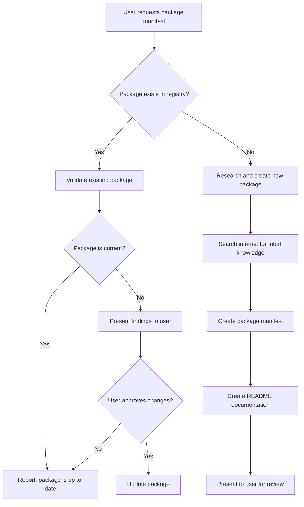

# Package Manifest Authoring Guide

Instructions for AI assistants to create or validate lore package manifests.

## Trigger

When the user says:

> **"give me a package manifest for `<product-name>`"**

Follow this workflow.

## Workflow Overview



## Phase 1: Check Existing Packages

**Always start here.** Search the registry before creating anything new.

### 1.1 Search the Registry

```
packages/<product-name>/
```

Also search for variations:
- Hyphenated: `aws-cli`, `azure-cli`
- Concatenated: `kubectl`, `terraform`
- Abbreviated: `xcode-clt` for "Xcode Command Line Tools"

### 1.2 If Package Exists: Validate Currency

Read the existing `lifecycle.yaml` and check:

| Check | How to Validate |
|-------|-----------------|
| **Version** | Search web for current stable version |
| **Installation method** | Verify documented method still works |
| **URLs** | Confirm homepage, repository URLs are valid |
| **Platform support** | Check if new platforms are supported |
| **Features** | Look for new optional components |

**Important**: Do NOT modify the existing package without explicit user approval. Present findings:

```
Package `<name>` exists in the registry.

Current state:
- Version in manifest: X.Y.Z
- Latest available: A.B.C
- Installation method: [still valid / changed]
- New features available: [list if any]

Would you like me to update the package manifest?
```

### 1.3 If Package Does Not Exist: Proceed to Phase 2

## Phase 2: Research Tribal Knowledge

This is the most important phase. Search the internet extensively.

### 2.1 Source Hierarchy

Consult sources in this order of priority:

#### Primary Sources (Always Consult First)

1. **Official documentation** — Vendor's installation guide, getting started docs
2. **Official repository** — GitHub/GitLab README, INSTALL.md, wiki
3. **Package manager formulae** — Homebrew formula, Debian package metadata, Chocolatey nuspec

#### First-Tier Reputable Sources

4. **Platform documentation** — Apple Developer, Microsoft Learn, Linux distribution docs
5. **Major package managers** — Homebrew, apt/dpkg, winget, Chocolatey documentation
6. **Established tech resources** — Arch Wiki, DigitalOcean tutorials, official cloud provider docs

#### User-Directed Sources

7. **Corporate/organizational sources** — Internal wikis, runbooks, or documentation the user provides
8. **Specific URLs** — Any source the user explicitly directs you to consult

**Important**: If the user provides a URL or mentions a corporate wiki, that source takes precedence for their specific environment. Always ask if there are internal sources to consult.

### 2.2 Required Searches

Perform these searches (adjust `<product>` as needed):

1. **Official installation docs**
   ```
   <product> install official documentation site:<vendor-domain>
   ```

2. **Platform-specific installation**
   ```
   <product> install macOS homebrew
   <product> install ubuntu apt
   <product> install windows winget
   ```

3. **Headless/automated installation**
   ```
   <product> install headless silent unattended scripted
   <product> install CI/CD automation
   ```

4. **Common problems and tribal knowledge**
   ```
   <product> install troubleshooting common issues
   <product> "command not found" after install
   <product> permission denied install
   ```

5. **Version detection**
   ```
   <product> check version installed
   <product> which version detect
   ```

6. **Uninstallation**
   ```
   <product> uninstall remove completely
   ```

### 2.3 Information to Extract

For each platform, gather:

| Information | Why It Matters |
|-------------|----------------|
| **Package manager commands** | `brew install`, `apt install`, `winget install` |
| **Package names per platform** | Often differ: `docker-ce` vs `Docker.DockerDesktop` |
| **Conflicting packages** | Must be removed first |
| **Post-install steps** | License acceptance, group membership, PATH updates |
| **Verification commands** | How to confirm working installation |
| **Hidden dependencies** | Things the docs don't mention |
| **Version compatibility** | OS version requirements, dependency versions |

### 2.4 Identify Tribal Knowledge

Look for patterns indicating tribal knowledge:

- Stack Overflow questions with many upvotes
- GitHub issues marked as "FAQ" or "common"
- Blog posts titled "What I wish I knew..." or "The right way to..."
- Reddit threads with complaints about installation
- Comments in Homebrew formulae or Dockerfiles

**Document the source URLs** — they go in the README.

## Phase 3: Create Package Manifest

### 3.1 Directory Structure

Phase scripts are organized by platform and pipeline. See [RFC Section 9.3](https://github.com/NobleFactor/noblefactor/blob/main/devlore/design/02-devlore-rfc.md) for the formal grammar.

```abnf
; Package Directory Structure (ABNF)
package           = "lifecycle.yaml" 1*platform-dir
platform-dir      = platform "/" 1*pipeline-dir
platform          = general-platform / linux-platform
general-platform  = ("Common" / "Darwin" / "Unix" / "Windows") *("." qualifier)
linux-platform    = "Linux" ["." distro-family] *("." qualifier)
distro-family     = "Debian" / "Fedora"
qualifier         = arch / custom
arch              = "amd64" / "arm64"
custom            = 1*ALPHA
pipeline-dir      = pipeline "/" 1*phase-script
pipeline          = "Deploy" / "Upgrade" / "Decommission"
phase-script      = phase ".star"
deploy-phase      = "prepare" / "install" / "provision" / "verify"
decom-phase       = "unprovision" / "uninstall" / "cleanup"
```

**Platform hierarchy (most general to most specific):**

| Platform | Matches |
|----------|---------|
| `Common` | All platforms |
| `Unix` | Darwin, Linux, BSD, etc. |
| `Darwin`, `Linux`, `Windows` | Specific OS families |
| `Linux.Debian`, `Linux.Fedora` | Linux distro families |

**Distro families:**

| Family | Includes | Detection |
|--------|----------|-----------|
| `Debian` | Debian, Ubuntu, Linux Mint, Pop!_OS, Raspbian | `ID_LIKE=debian` |
| `Fedora` | Fedora, RHEL, CentOS, Rocky, AlmaLinux, Oracle Linux, Amazon Linux, Azure Linux | `ID_LIKE=fedora` or explicit mapping |

**Family detection:** Uses `/etc/os-release` fields `ID` and `ID_LIKE`. Some distros require explicit mapping:
- Amazon Linux: Has `ID_LIKE=fedora` ✓
- Azure Linux: Missing `ID_LIKE` — requires explicit mapping ([issue #2296](https://github.com/microsoft/azurelinux/issues/2296))

**Qualifiers:** Add `.<arch>` or `.<custom>` suffixes for further specificity (e.g., `Darwin.arm64`, `Linux.Debian.arm64`).

**Example: cross-platform package**

```
packages/kubectl/
├── lifecycle.yaml
├── README.md
└── Common/
    ├── Deploy/
    │   ├── prepare.star
    │   ├── install.star
    │   ├── provision.star
    │   └── verify.star
    └── Decommission/
        ├── unprovision.star
        └── uninstall.star
```

**Example: platform-specific package**

```
packages/docker/
├── lifecycle.yaml
├── README.md
├── Darwin/
│   └── Deploy/
│       ├── prepare.star
│       ├── install.star
│       ├── provision.star
│       └── verify.star
├── Linux.Debian/
│   └── Deploy/
│       ├── prepare.star
│       ├── install.star
│       ├── provision.star
│       └── verify.star
└── Linux.Fedora/
    └── Deploy/
        ├── prepare.star
        ├── install.star
        ├── provision.star
        └── verify.star
```

The distro qualifier (`.Debian`, `.Fedora`) is optional — only use when installation differs between distributions.

### 3.2 Script Chaining (General → Specific)

When a phase is executed, **all matching scripts run in order from most general to most specific**. This enables composable, layered scripts.

**Execution order for `Linux.Debian`:**

```
Common/Deploy/install.star      → runs first (base setup)
    ↓
Unix/Deploy/install.star        → runs second (Unix-specific)
    ↓
Linux/Deploy/install.star       → runs third (Linux-specific)
    ↓
Linux.Debian/Deploy/install.star → runs last (Debian-specific)
```

**Execution order for `Darwin`:**

```
Common/Deploy/install.star → Unix/Deploy/install.star → Darwin/Deploy/install.star
```

**Execution order for `Windows`:**

```
Common/Deploy/install.star → Windows/Deploy/install.star
```

Only scripts that exist are executed. If you only have `Common/Deploy/install.star`, that's the only script that runs.

#### When to Use Chaining

| Use Case | Approach |
|----------|----------|
| **Same logic, different package names** | Put logic in `Common/`, use `system.has()` to select package name |
| **Base setup + platform additions** | Common setup in `Common/`, platform-specific additions in `Darwin/`, `Linux/`, etc. |
| **Completely different approaches** | Skip `Common/`, put full logic in each platform directory |

#### Chaining Risks and Safe Patterns

**Risk 1: Duplicate operations**

If `Common/Deploy/install.star` calls `plan.install("curl")` and `Darwin/Deploy/install.star` also calls `plan.install("curl")`, the operation is queued twice.

**Safe pattern:** Put shared installations in `Common/` only. Platform scripts add platform-specific packages:

```python
# Common/Deploy/install.star
def install(system, package, plan):
    plan.install("curl")  # Needed everywhere
    plan.install("jq")    # Needed everywhere

# Darwin/Deploy/install.star
def install(system, package, plan):
    # Don't repeat curl/jq — Common already handles them
    plan.install("coreutils")  # macOS-specific addition
```

**Risk 2: Conflicting operations**

If `Common/` removes a package that `Darwin/` tries to configure, the chain fails.

**Safe pattern:** Use `Common/` for truly universal operations. Put conditional logic in the most general script that needs it:

```python
# Common/Deploy/prepare.star
def prepare(system, package, plan):
    # Remove conflicts on all platforms
    if system.installed("docker.io"):
        plan.remove("docker.io")

    # Platform-specific conflict only on Linux
    if system.platform() == "Linux" and system.installed("podman-docker"):
        plan.remove("podman-docker")
```

**Risk 3: Order-dependent state**

Later scripts may assume earlier scripts have run. If a script is missing in the chain, assumptions break.

**Safe pattern:** Each script should be defensive — check state before acting:

```python
# Linux.Debian/Deploy/provision.star
def provision(system, package, plan):
    # Don't assume Common/provision.star ran
    if not system.path_exists("/etc/docker"):
        plan.run("mkdir -p /etc/docker")

    plan.write_file("/etc/docker/daemon.json", '{"storage-driver": "overlay2"}')
```

**Risk 4: Feature flags across scripts**

If a feature is checked in multiple scripts, ensure consistent behavior.

**Safe pattern:** Check features at the most specific level where they matter:

```python
# Common/Deploy/install.star
def install(system, package, plan):
    plan.install("docker-ce")
    # Don't check rootless here — it's platform-specific

# Linux/Deploy/provision.star
def provision(system, package, plan):
    if package.feature("rootless"):
        plan.install("uidmap")
        plan.run("dockerd-rootless-setuptool.sh install")
```

#### When NOT to Chain

For packages where platforms require completely different approaches, skip `Common/` entirely:

```
packages/docker/
├── lifecycle.yaml
├── Darwin/Deploy/       # Docker Desktop (Homebrew cask)
├── Linux.Debian/Deploy/ # Docker CE (apt repo setup)
├── Linux.Fedora/Deploy/ # Docker CE (dnf repo setup)
└── Windows/Deploy/      # Docker Desktop (winget)
```

Each platform script is self-contained. No chaining occurs because there's no `Common/` directory.

### 3.3 lifecycle.yaml Template

Phase scripts are discovered from the directory structure — do NOT include a `phases:` section.

```yaml
# SPDX-License-Identifier: MIT
# Copyright (c) 2025 Noble Factor. All rights reserved.
#
# <package-name> - Package Lifecycle Manifest
# <brief description>
#
# Reference: <official-docs-url>

name: <package-name>
version: "<current-stable-version>"
description: <one-line description>
homepage: <official-homepage>
repository: <source-repo-if-applicable>
license: <SPDX-license-identifier>
maintainer: Noble Factor

aliases:
  - <alternative name for search>
  - <another alternative>

platforms:
  - Darwin    # Include only supported platforms
  - Linux
  - Windows

features:
  <feature-name>:
    description: <what it enables>
    default: <true|false>

settings:
  <setting-name>:
    description: <what it configures>
    type: string
    default: "<default-value>"
    values: ["option1", "option2"]  # If enumerated

provides:
  - <command this package provides>

conflicts:
  - <conflicting-package>  # Packages that must be removed first

verification:
  command: "<tool> --version"
  pattern: "<regex-to-match-version>"

tags:
  - <category>
  - <keyword>
```

### 3.4 Phase Script Templates

Phase scripts receive three inputs and build an execution graph. **Scripts express intent, not commands** — never shell out to package managers directly.

```python
# SPDX-License-Identifier: MIT
# Copyright (c) 2025 Noble Factor. All rights reserved.
#
# <package>/<platform>/Deploy/<phase>.star
#
# TRIBAL KNOWLEDGE:
# <Document the hard-won insights this phase implements>

def <phase>(system, package, plan):
    """<Phase description>.

    Args:
        system: Query target environment (read-only, immediate)
        package: Package metadata and features (read-only, immediate)
        plan: Build execution graph (write, deferred execution)
    """

    # Query system state (immediate)
    if system.installed("conflicting-package"):
        plan.remove("conflicting-package")

    # Check package features (from lifecycle.yaml, enabled via --with)
    if package.feature("optional-component"):
        plan.install("optional-component-package")

    # Build execution graph (deferred)
    plan.install("main-package")
```

**CORRECT — Express intent:**
```python
plan.install("docker-ce")
plan.remove("docker.io")
```

**WRONG — Never shell out to package managers:**
```python
plan.run("apt install docker-ce")      # ❌ Never do this
plan.run("brew install docker")        # ❌ Never do this
```

Platform selection happens via directory structure (`Darwin/Deploy/install.star` vs `Linux.Debian/Deploy/install.star`), not conditionals in scripts.

### 3.5 Phase Responsibilities

| Phase | Responsibility | Key `plan` Operations |
|-------|----------------|----------------------|
| **prepare** | Validate preconditions, remove conflicts | `plan.remove()`, `plan.download()` (GPG keys), `plan.write_file()` (repo config) |
| **install** | Acquire software | `plan.install()`, `plan.download()`, `plan.extract()` |
| **provision** | Configure for use | `plan.write_file()`, `plan.add_user_to_group()`, `plan.enable_service()` |
| **verify** | Confirm working | `plan.verify()`, `plan.run()` (smoke tests only) |

### 3.6 Binding Methods

Phase functions receive three inputs with distinct methods:

**`system` — Query environment (read-only, immediate)**

| Method | Description |
|--------|-------------|
| `system.has(pm)` | Check if package manager is available |
| `system.installed(pkg)` | Check if package is installed |
| `system.version(pkg)` | Get installed package version |
| `system.path(p)` | Resolve path (expands `~`, env vars) |
| `system.path_exists(p)` | Check if path exists |
| `system.which(cmd)` | Find command in PATH |
| `system.platform()` | Current platform (Darwin, Linux, Windows) |
| `system.distro()` | Linux distribution ID (ubuntu, fedora, amzn, etc.) |
| `system.arch()` | Architecture (amd64, arm64) |

**`package` — Package metadata (read-only, immediate)**

| Method | Description |
|--------|-------------|
| `package.name` | Package name |
| `package.version` | Package version |
| `package.feature(name)` | Check if feature is enabled (via `--with`) |
| `package.setting(name, default)` | Get setting value |

**`plan` — Build execution graph (deferred)**

| Method | Description |
|--------|-------------|
| `plan.install(pkg)` | Install package |
| `plan.remove(pkg)` | Remove package |
| `plan.download(url, dest)` | Download file (returns promise) |
| `plan.extract(archive, dest)` | Extract archive |
| `plan.write_file(path, content)` | Write file |
| `plan.configure(name, **kwargs)` | Configure component |
| `plan.verify(name, check)` | Add verification check |
| `plan.run(cmd)` | Run command (use sparingly) |
| `plan.add_user_to_group(user, group)` | Add user to group |
| `plan.enable_service(name)` | Enable system service |
| `plan.start_service(name)` | Start system service |

**Promise-based data flow:** Methods like `plan.download()` return promises. Pass promises to dependent operations to create graph edges:

```python
tarball = plan.download(url="https://example.com/app.tar.gz")
plan.extract(tarball, dest="/usr/local")  # depends on tarball
```

## Phase 4: Create README Documentation

### 4.1 README Template

```markdown
# <Package Name> - lore Package

<One-paragraph description of what this package installs and why it matters.>

## Tribal Knowledge

<This is the most important section. Document the hard-won insights.>

### <Problem 1 Title>

<Explain the problem and solution. Include file references like `install.star:45-67`.>

### <Problem 2 Title>

<Continue for each piece of tribal knowledge.>

## Usage

\`\`\`bash
# Basic installation
lore deploy <package>

# With features
lore deploy <package> --with <feature>

# With settings
lore deploy <package> --with <setting>=<value>

# Decommission
lore decommission <package>
\`\`\`

## Features

| Feature | Default | Description |
|---------|---------|-------------|
| `<name>` | `<default>` | <description> |

## Settings

| Setting | Default | Description |
|---------|---------|-------------|
| `<name>` | `<default>` | <description> |

## Directory Structure

\`\`\`
<package>/
├── lifecycle.yaml          # Package metadata, features, settings
├── README.md               # This file
└── <platform>/             # Common/, Unix/, Darwin/, Linux.Debian/, etc.
    └── Deploy/
        ├── prepare.star    # <What prepare does>
        ├── install.star    # <What install does>
        ├── provision.star  # <What provision does>
        └── verify.star     # <What verify does>
\`\`\`

## Sources

Primary and first-tier sources consulted:

- [<Official Doc Title>](<url>) — <Why this source was useful>
- [<Source Title>](<url>) — <Why this source was useful>
```

**Note**: List primary sources (official docs, vendor sites) first, followed by first-tier reputable sources. If user-directed sources were consulted, list them with attribution.

### 4.2 Tribal Knowledge Documentation Standards

Good tribal knowledge documentation:

- **Names the problem** — "The Headless Installation Problem"
- **Explains why it matters** — "useless for automation, VMs, CI/CD"
- **Provides the solution** — Step-by-step what the code does
- **References the implementation** — `install.star:28-51`
- **Cites sources** — Where you learned this

## Phase 5: Present to User

After creating all files, present a summary:

```
Created package manifest for `<package-name>`:

## Package Location
<tree diagram of created files>

## Key Tribal Knowledge Encoded
<bullet list of the main insights>

## Features & Settings
<summary of configurable options>

## Sources Consulted
<list of URLs>

Please review the created files. Would you like me to make any changes?
```

## Validation Checklist

Before presenting to user, verify:

- [ ] `lifecycle.yaml` has valid YAML syntax and validates against schema
- [ ] `lifecycle.yaml` does NOT contain a `phases:` section (discovered from dirs)
- [ ] Platform directories match declared `platforms:` in lifecycle.yaml
- [ ] Phase scripts use three-input signature: `def <phase>(system, package, plan):`
- [ ] Phase scripts express intent (`plan.install()`) not commands (`plan.run("apt install")`)
- [ ] Verification command actually tests the tool works
- [ ] README documents all features and settings from lifecycle.yaml
- [ ] Tribal knowledge section has file references
- [ ] Sources section lists URLs consulted

## Example: Complete Workflow

**User**: "give me a package manifest for ripgrep"

**AI Response**:

1. Check `packages/ripgrep/` — not found
2. Search: "ripgrep install", "rg install homebrew apt", "ripgrep shell completions"
3. Discover:
   - Package names: `ripgrep` (most), `rg` (some)
   - Completions require shell-specific setup
   - Ubuntu PPA has newer versions than apt
4. Create:
   - `lifecycle.yaml` — metadata, features, platforms
   - `Common/Deploy/` — phase scripts (cross-platform via package managers)
   - `README.md` — tribal knowledge documentation
5. Present summary with tribal knowledge about completions and Ubuntu PPA
