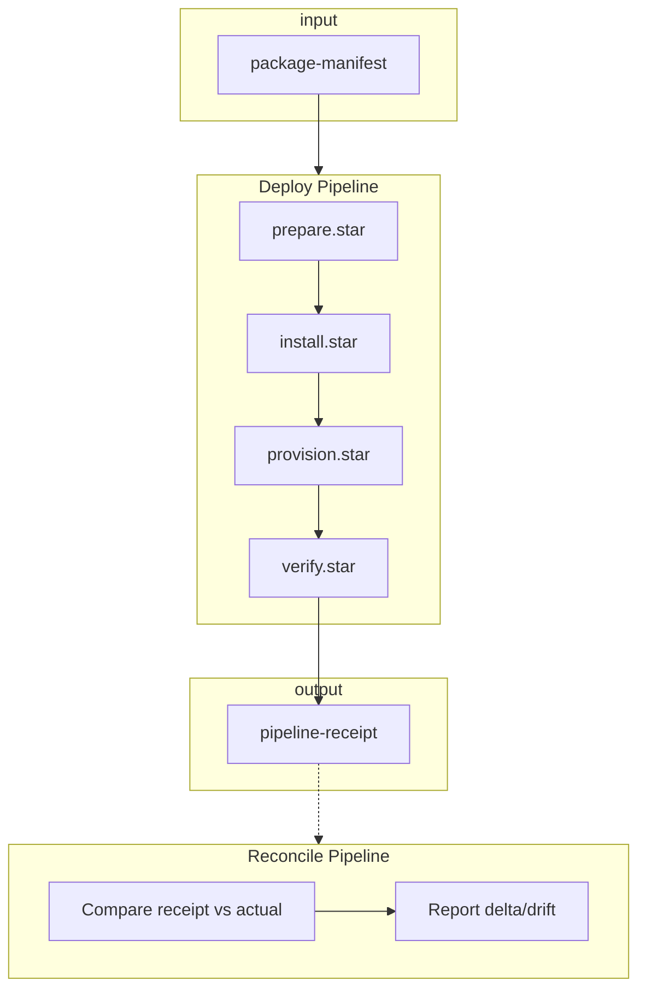
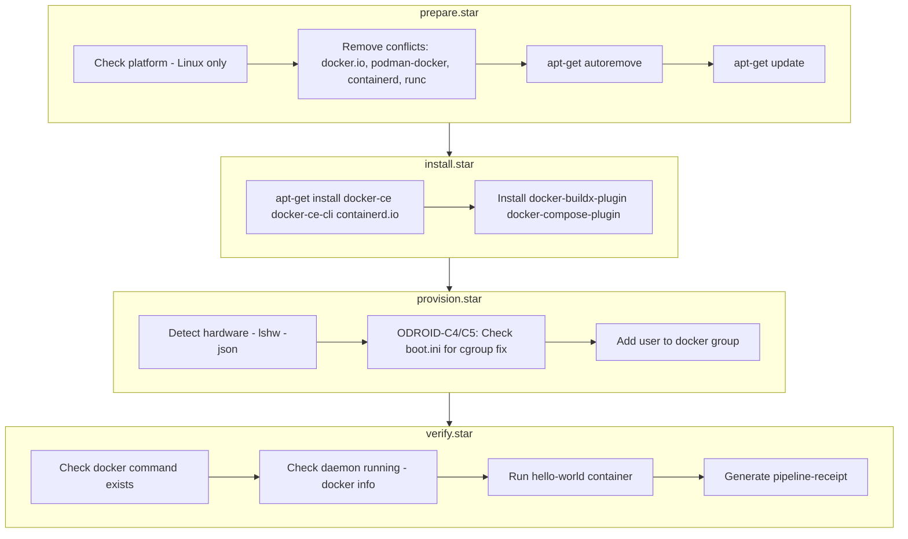

# Docker Package Lifecycle Example

This directory contains a fully worked example of a lore package-lifecycle-manifest using Starlark phase scripts.

## Usage

```bash
# Deploy docker
lore deploy docker

# Deploy with features
lore deploy docker --with rootless

# Reconcile: compare receipt vs actual system state
lore reconcile @docker.receipt
```

## Files

| File | Purpose |
|------|---------|
| `lifecycle.yaml` | Package lifecycle manifest: conflicts, packages, hardware provisions, pipelines |
| `prepare.star` | Phase 1: Remove conflicts, update package lists |
| `install.star` | Phase 2: Install docker packages via apt |
| `provision.star` | Phase 3: Hardware config, add user to docker group |
| `verify.star` | Phase 4: Confirm installation, generate pipeline-receipt |

## Deploy Pipeline Flow



## Phase Details



## Phase Contract

```python
def main(lifecycle, state, features, settings):
    """
    Args:
        lifecycle: Package lifecycle manifest from YAML (dict)
        state:     Output from previous phase (dict)
        features:  List of enabled features (e.g., ["rootless"])
        settings:  Dict of settings (e.g., {"storage-driver": "overlay2"})

    Returns:
        dict: State passed to next phase (becomes part of pipeline-receipt)

    Logging API:
        note(msg)           - Informational, continues execution
        warn(msg)           - Warning, continues execution
        error(msg)          - Fails phase, triggers rollback
        success(msg, state) - Exits phase successfully (early exit)
    """
```

## Platform Object

Available in all phases as `platform`:

```python
platform.os      # "darwin", "linux", "windows" (GOOS)
platform.arch    # "amd64", "arm64" (GOARCH)
platform.distro  # "macos", "ubuntu", "debian", "fedora", etc.
```

## Data Artifacts

| Artifact | Description |
|----------|-------------|
| `docker --with rootless` | package-spec: single package with features |
| `@workstation.manifest` | package-manifest: list of package-specs |
| `workstation.receipt` | pipeline-receipt: post-deploy state, enables reconcile |
| `docker/lifecycle.yaml` | package-lifecycle-manifest: defines deploy/upgrade/decommission |

## Tribal Knowledge Captured

This package captures knowledge that would otherwise be tribal:

1. **Conflicting packages** - docker.io, podman-docker, containerd, runc must be removed first
2. **ODROID cgroup fix** - C4/C5 boards need `systemd.unified_cgroup_hierarchy=0` in boot.ini
3. **User group membership** - Add user to docker group to avoid sudo requirement
4. **Post-install verification** - Run hello-world to confirm working installation
