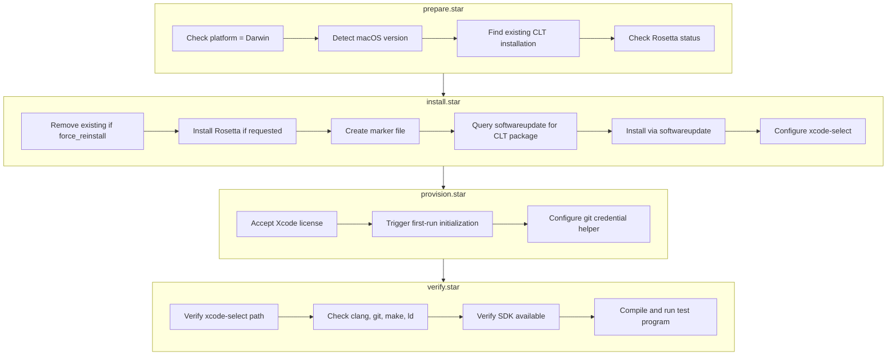

# Xcode Command Line Tools - lore Package

Compilers, linkers, and build tools for macOS development. This is the foundation for Homebrew, native extension compilation, and any C/C++/Objective-C/Swift development on macOS.

## Tribal Knowledge

This package encodes knowledge that takes hours to discover through trial and error:

### The Headless Installation Problem

The standard `xcode-select --install` opens a GUI dialog — useless for automation, VMs, CI/CD, or any headless scenario. The community-discovered workaround (used by Homebrew):

1. Create marker file: `/tmp/.com.apple.dt.CommandLineTools.installondemand.in-progress`
2. This tricks `softwareupdate` into listing the CLT package
3. Parse the package name from `softwareupdate -l` output
4. Install via `softwareupdate -i "<package-name>"`
5. Remove the marker file

**Reference**: `install.star:28-51`

### Detection Is Harder Than It Looks

Multiple methods exist, each with caveats:

| Method | What It Tells You | Caveat |
|--------|-------------------|--------|
| `xcode-select -p` | Active developer directory | Can point to nonexistent path |
| `pkgutil --pkg-info=com.apple.pkg.CLTools_Executables` | Package receipt version | Stale after macOS upgrades |
| `clang --version` | Actual working compiler | Best reliability check |
| `/Library/Developer/CommandLineTools` exists | Directory present | May be corrupted/incomplete |

**Reference**: `prepare.star:83-145`

### Full Xcode vs Standalone CLT

- `/Library/Developer/CommandLineTools` = standalone CLT (~2GB)
- `/Applications/Xcode.app/Contents/Developer` = full Xcode (~12GB, includes CLT)

Both work; `xcode-select -p` shows which is active. The `allow_xcode_fallback` setting controls behavior when full Xcode is detected.

### License Acceptance

After installation, tools fail with "agreeing to license" errors until you run:

```bash
sudo xcodebuild -license accept
```

**Reference**: `provision.star:53-83`

### No Upgrade Path

There's no `xcode-select --upgrade`. To update CLT:

1. Remove existing: `sudo rm -rf /Library/Developer/CommandLineTools`
2. Reinstall via softwareupdate

The `force_reinstall` setting automates this.

### Version Must Match macOS

CLT version is tied to macOS version. Mismatches cause:
- Missing SDK headers
- Compiler errors
- Homebrew warnings

After macOS upgrades, CLT often needs reinstallation.

## Usage

```bash
# Basic installation
lore deploy xcode-clt

# With Rosetta 2 for x86_64 compatibility (Apple Silicon)
lore deploy xcode-clt --with rosetta

# Force reinstall (removes existing first)
lore deploy xcode-clt --with force_reinstall=true

# Skip compilation test during verification
lore deploy xcode-clt --with verify-full=false

# Decommission (uninstall)
lore decommission xcode-clt
```

## Features

| Feature | Default | Description |
|---------|---------|-------------|
| `rosetta` | false | Install Rosetta 2 for x86_64 emulation (Apple Silicon only) |
| `verify-full` | true | Run compilation test during verification |

## Settings

| Setting | Default | Description |
|---------|---------|-------------|
| `allow_xcode_fallback` | true | Use full Xcode.app if installed |
| `force_reinstall` | false | Remove and reinstall even if present |
| `min_macos_version` | (auto) | Override minimum macOS version check |

## Files

| File | Purpose |
|------|---------|
| `lifecycle.yaml` | Package metadata, features, settings, platform declaration |
| `prepare.star` | Detect macOS version, existing installations, validate prerequisites |
| `install.star` | Headless CLT installation via softwareupdate, Rosetta installation |
| `provision.star` | License acceptance, git credential helper, first-run initialization |
| `verify.star` | Tool verification, SDK check, compilation test |

## Pipeline Flow



## Sources

Installation methods researched from:

- [Xcode Command Line Tools - Mac Install Guide](https://mac.install.guide/commandlinetools/) — Comprehensive installation guide
- [How to install without GUI - mokacoding](https://mokacoding.com/blog/how-to-install-xcode-cli-tools-without-gui/) — The headless method
- [Apple Developer Forums - Automate Install](https://forums.developer.apple.com/forums/thread/698954) — Community solutions
- [Der Flounder - CLT installer script](https://derflounder.wordpress.com/2018/06/10/updated-xcode-command-line-tools-installer-script-now-available/) — Enterprise deployment scripts
- [Homebrew install.sh](https://github.com/Homebrew/install/blob/master/install.sh) — Production implementation of headless method
- [Apple Developer Documentation](https://developer.apple.com/documentation/xcode/installing-the-command-line-tools/) — Official docs
- [xcodereleases.com](https://xcodereleases.com/) — Version compatibility matrix
